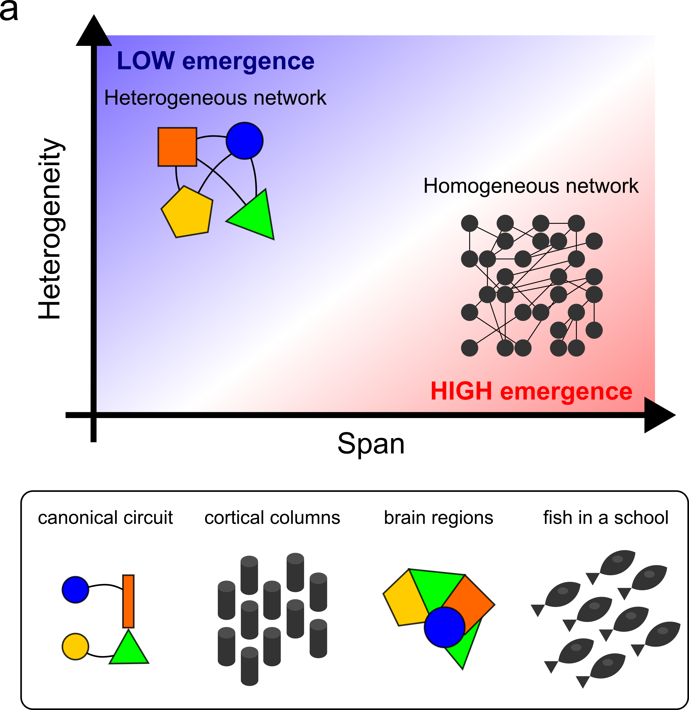

<p align="center">
    
</p>
<p align="center"><h1 align="center">HETEROGENEITY</h1></p>
<p align="center">
	<em>Exploring the heterogeneity-span tradeoff</em>
</p>
<p align="center">
	
	
	
</p>
<p align="center"><!-- default option, no dependency badges. -->
</p>
<p align="center">
	<!-- default option, no dependency badges. -->
</p>
<br>


## 📍 Overview

The Heterogeneity Project explores the role of heterogeneity in neural network architectures by exploring diverse activation functions and optimisation algorithms. We want to understand why biology often come with tin, highly heterogeneous networks solutions that require big population for their homogeneous counterparts to solve.  

---
## 🚀 Setup

### Dependencies

- Python 3.11
- NEAT-Python (@Finebouche branch)
- Farama Gymnasium

### Installation

1. Clone the repository:
    ```bash
    git clone https://github.com/Finebouche/neat-gymnasium.git
    cd heterogeneous
    ```

2. Install the required packages:
    ```bash
    conda env create -f environment.yml  
    ```


### 🤖 Usage

Run heterogeneity using the following command:
**Using `conda`** &nbsp; [](https://docs.conda.io/)

```sh
❯ conda activate het_env
```


## 🎗 License

This project is protected under the [MIT License ](https://choosealicense.com/licenses/mit/) License.

---

## 🙌 Acknowledgments

- List any resources, contributors, inspiration, etc. here.
